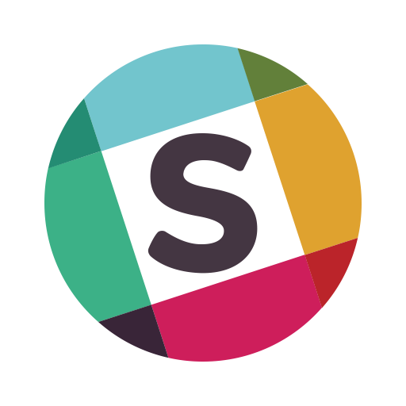

# Utrum Wallet

Official "Utrum Wallet" based on Electrum.
BTC / KMD / OOT wallet with basic features: balances, withdrawals & history.
This wallet is based on the work of the MNZ team, with special features: couponing, multisig ...

#### Build Setup

``` bash
## (npm and yarn friendly)

# install dependencies
yarn install

# serve with hot reload at localhost:9080
yarn run dev

# build electron application for production on your current platform
yarn run build

# run unit tests
yarn test

```
#### Release

Thanks to gitlab.com this software is subject to a CI process building on-demand releases available for [download here](https://gitlab.com/monaize-mnz/mnz-wallet/tags).
To avoid any misebehaviour, the test releases available on gitlab are always built for testnet/testcoins (TESTMNZ / TESTKMD / Bitcoin testnet).

*TESTMNZ and TESTKMD are additional asset chains maintained by the MNZ team meant for testing ONLY.
- Explorers available: https://mnz.explorer.monaize.com/, https://kmd.explorer.monaize.com/.
- Faucet for TESTKMD: https://faucet.monaize.com/.

The official production releases (MNZ/KMD/BTC) for the public token sale will be available for download only through [monaize.com/ico](https://monaize.com/ico).  
**WARNING**: Make sure you get the official release using the **checksum**, more info in the [token sale participation disclaimer](https://gitlab.com/monaize-mnz/mnz-wallet/blob/master/LEGAL/DISCLAIMER).

#### Contributions

If you find a bug or you want to propose a feature, you should create a issue on this repo. (example: ```fix|feat(scope): Issue```)

Some questions about the wallet ? Join on:

Slack | Telegram | WebSite
--------------- | ---- | ---
[](https://docs.google.com/forms/d/e/1FAIpQLScre9X8loy1Q5zhelpqVfCib65m4PKc2kWUKKYgDIE67Mx9Pg/viewform) | [](https://t.me/MonaizeOfficial) | [](https://monaize.com/#/uk/ico)

#### Built with ♥️ by the MNZ team
- [electron-vue](https://github.com/SimulatedGREG/electron-vue)@[1c165f7](https://github.com/SimulatedGREG/electron-vue/tree/1c165f7c5e56edaf48be0fbb70838a1af26bb015) using [vue-cli](https://github.com/vuejs/vue-cli) . 
- [node-electrum-client](https://github.com/Monaize/node-electrum-client/tree/electrumx-persistence) dealing with a network of [electrumX](https://github.com/Monaize/electrumx) servers ran by [docker-electrumX](https://github.com/Monaize/docker-electrumx) images.
- "MNZ" is a [Komodo](https://github.com/Monaize/komodo) asset chain.


## A wallet for a token sale
The latest white paper is [right here](https://monaize.com/assets/pdf/monaize_whitepaper.pdf).

#### Disclaimer

Token sale participation [disclaimer](https://gitlab.com/monaize-mnz/mnz-wallet/blob/master/LEGAL/DISCLAIMER).

#### Terms and conditions

MNZ Wallet [Terms and conditions](https://gitlab.com/monaize-mnz/mnz-wallet/blob/master/LEGAL/TERMS_AND_CONDITIONS).

#### Software license

```
Copyright © 2018 Monaize Singapore PTE. LTD

This program is free software: you can redistribute it and/or modify
it under the terms of the GNU General Public License version 3,
as published by the Free Software Foundation.

This program is distributed in the hope that it will be useful,
but WITHOUT ANY WARRANTY; without even the implied warranty of
MERCHANTABILITY or FITNESS FOR A PARTICULAR PURPOSE.  See the
GNU General Public License for more details.

You should have received a copy of the GNU General Public License
along with this program.  If not, see <http://www.gnu.org/licenses/>.
```

The MNZ wallet repository is licensed under the GNU General Public License v3.0, also included in our repository in the [COPYING](https://gitlab.com/monaize-mnz/mnz-wallet/blob/master/LEGAL/COPYING) file.
